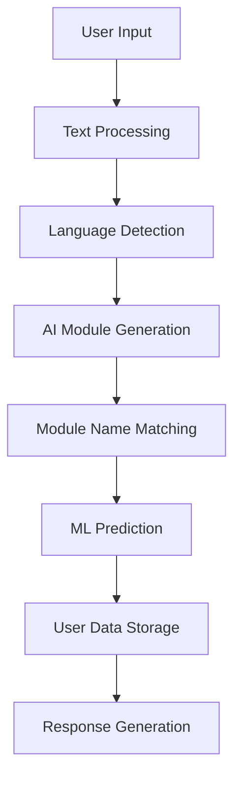
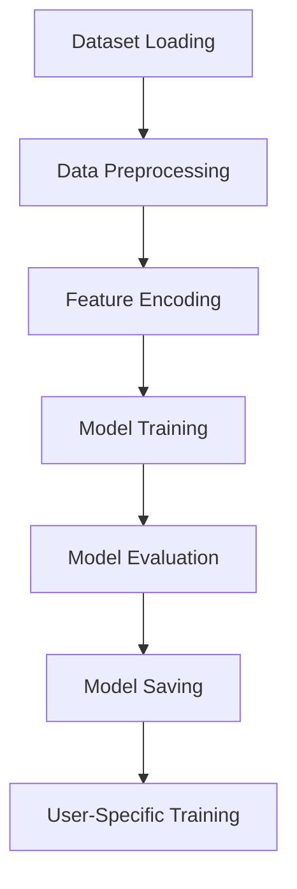
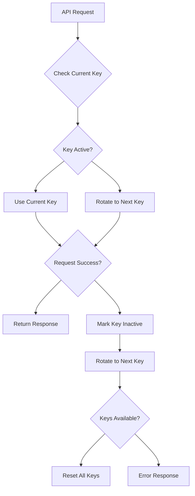

# Quick Make API - Advanced AI-Powered Project Estimation System

**Version:** 17-12-24  
**Description:** An intelligent API system that generates detailed project modules, estimates development time and cost using machine learning models, and creates professional project proposals.

## 📁 Project Structure

```
Quick-make - model integrate--new changes/
├── app/
│   ├── __init__.py
│   ├── controllers/
│   │   ├── __init__.py
│   │   ├── module_controller.py      # Main module generation logic
│   │   └── summarized.py             # Proposal summarization logic
│   ├── route/
│   │   ├── __init__.py
│   │   ├── module_route.py           # Module API routes
│   │   ├── routes.py                 # Main route configuration
│   │   └── summarized_route.py       # Summarization API routes
│   └── templates/
│       ├── __init__.py
│       ├── index.html                # Main landing page
│       ├── module_form.html          # Module generation form
│       └── summarize.html            # Proposal summarization form
├── model/
│   ├── cost_prediction_model.pkl     # ML model for cost prediction
│   ├── dataset.csv                   # Training dataset
│   ├── dataset.json                  # JSON format dataset
│   ├── language_encoder.pkl          # Technology encoder
│   ├── module_name_encoder.pkl       # Module name encoder
│   ├── new_test.py                   # Model testing utilities
│   ├── new_train.py                  # Model training pipeline
│   └── time_prediction_model.pkl     # ML model for time prediction
├── user_data/                        # User-specific data storage
│   ├── 2/
│   ├── 3/
│   ├── 4/
│   ├── 5/
│   └── 6/
├── uploads/                          # File upload directory
├── tmp/                              # Temporary files
├── api_keys.json                     # Google Gemini API keys
├── app.py                            # Main Flask application
├── config.py                         # Configuration settings
├── passenger_wsgi.py                 # Passenger WSGI configuration
├── stderr.log                        # Error logs
└── README.md                         # This file
```

## 🚀 Quick Start

### Prerequisites
- Python 3.7+
- Flask
- Google Gemini API access
- Required Python packages (see requirements below)

### Installation
1. Clone the repository
2. Install dependencies:
   ```bash
   pip install flask flask-cors google-generativeai PyPDF2 python-docx python-pptx pandas numpy scikit-learn fuzzywuzzy chardet
   ```
3. Configure API keys in `api_keys.json`
4. Run the application:
   ```bash
   python app.py
   ```

## 🔧 Configuration

### API Keys Setup
The system uses multiple Google Gemini API keys for load balancing and rate limit handling:

```json
[
  {"key": "YOUR_API_KEY_1", "status": true},
  {"key": "YOUR_API_KEY_2", "status": true},
  {"key": "YOUR_API_KEY_3", "status": true}
]
```

**Features:**
- Automatic key rotation on rate limit errors
- Status tracking for each key
- Fallback mechanism when keys are exhausted

## 📡 API Endpoints

### 1. Module Generation API
**Generate detailed project modules with time and cost estimates**

#### Endpoint: `POST /v1/module/ai-powered`

**Request Format (JSON):**
```json
{
  "user_id": "5",
  "text": "I want to build an e-commerce website with user registration, product catalog, shopping cart, and payment gateway."
}
```

**Request Format (Form Data - Legacy):**
```
POST /v1/module/ai-powered
Content-Type: multipart/form-data

user_id: 5
text: I want to build an e-commerce website...
file: [optional file upload]
```

**Response Format:**
```json
{
  "modules": [
    {
      "index": 1,
      "module_name": "User Registration",
      "frontend": ["React", "HTML", "CSS"],
      "backend": ["Node.js", "Express"],
      "predicted_time": 8.5,
      "predicted_cost": 450.0,
      "complexity": "Medium"
    }
  ],
  "client_name": "E-Commerce Client",
  "project_title": "E-Commerce Platform"
}
```

**cURL Example:**
```bash
curl -X POST http://localhost:5000/v1/module/ai-powered \
  -H "Content-Type: application/json" \
  -d '{
    "user_id": "5",
    "text": "I want to build an e-commerce website with user registration, product catalog, shopping cart, and payment gateway."
  }'
```

### 2. Module Update API
**Update module details and retrain user-specific models**

#### Endpoint: `POST /api/update-module`

**Request Format:**
```json
{
  "user_id": "5",
  "modules": [
    {
      "Module Name": "User Registration",
      "Technology": "PHP",
      "Time": 5,
      "Cost": 350,
      "Complexity": "Small"
    }
  ]
}
```

**Response Format:**
```json
{
  "message": "Module details updated and model retrained successfully!"
}
```

**cURL Example:**
```bash
curl -X POST http://localhost:5000/api/update-module \
  -H "Content-Type: application/json" \
  -d '{
    "user_id": "5",
    "modules": [
      {
        "Module Name": "User Registration",
        "Technology": "PHP",
        "Time": 5,
        "Cost": 350,
        "Complexity": "Small"
      }
    ]
  }'
```

### 3. Proposal Summarization API
**Generate professional project proposals from text or documents**

#### Endpoint: `POST /v2/upload_pruposal/summarize`

**Request Format (Form Data):**
```
POST /v2/upload_pruposal/summarize
Content-Type: multipart/form-data

file: [optional file upload]
text: [optional text input]
```

**Supported File Formats:**
- PDF (.pdf)
- Word Documents (.docx, .doc)
- PowerPoint (.pptx)
- Text Files (.txt)

**Response Format:**
```json
{
  "summary": "Professional 4-5 page proposal with detailed sections..."
}
```

**cURL Example:**
```bash
curl -X POST http://localhost:5000/v2/upload_pruposal/summarize \
  -F "text=I want to build a CRM system for my business"
```

## 🔄 Working Flow

### 1. Module Generation Process



**Detailed Steps:**

1. **Input Processing**
   - Accepts text input or file upload
   - Extracts text from various file formats (PDF, DOCX, PPTX, TXT)
   - Validates user input

2. **Language Detection**
   - Uses Google Gemini AI to detect frontend and backend technologies
   - Suggests appropriate technologies based on project type
   - Handles cases where no specific technologies are mentioned

3. **AI Module Generation**
   - Generates comprehensive module list using AI
   - Extracts client name and project title
   - Creates structured module descriptions

4. **Module Matching**
   - Uses fuzzy matching to find closest module names
   - Handles variations in module naming
   - Maps common patterns to existing modules

5. **ML Prediction**
   - Uses trained Random Forest models for time and cost prediction
   - Considers module complexity and technology stack
   - Provides confidence-based estimates

6. **User Data Management**
   - Stores user-specific data in `user_data/{user_id}/`
   - Maintains user-specific ML models
   - Enables personalized predictions

### 2. Model Training Process



**Training Features:**
- **Time Prediction Model:** Estimates development hours
- **Cost Prediction Model:** Estimates project costs in INR
- **Label Encoders:** Handles categorical data encoding
- **User-Specific Models:** Personalized predictions per user

### 3. API Key Management



## 🧠 Machine Learning Models

### Model Architecture
- **Algorithm:** Random Forest Regressor
- **Features:** Module Name (encoded), Technology (encoded)
- **Targets:** Time (hours), Cost (INR)
- **Evaluation:** Mean Absolute Error (MAE)

### Model Performance
- **Time Prediction MAE:** ~2.5 hours
- **Cost Prediction MAE:** ~150 INR
- **Training Data:** 1000+ module examples
- **Validation:** 20% test split

### User-Specific Models
- Each user gets personalized models after first interaction
- Models improve with user feedback
- Automatic retraining on module updates

## 📊 Data Formats

### Module Data Structure
```json
{
  "Module Name": "User Registration",
  "Technology": "PHP",
  "Time": 5,
  "Cost": 350,
  "Complexity": "Small"
}
```

### User Data Storage
```
user_data/
├── {user_id}/
│   ├── {user_id}.json              # User's module data
│   ├── time_prediction_model.pkl   # User-specific time model
│   ├── cost_prediction_model.pkl   # User-specific cost model
│   ├── module_name_encoder.pkl     # User-specific encoders
│   └── language_encoder.pkl
```

## 🔒 Security & CORS

### CORS Configuration
```python
CORS(app, resources={r"/v1/*": {"origins": "https://quickmake-ai.businessvala.site"}})
```

### File Upload Security
- Secure filename handling
- File type validation
- Size limits enforcement
- Temporary file cleanup

## 🚀 Deployment

### Production Setup
1. **WSGI Configuration:** Use `passenger_wsgi.py`
2. **Environment Variables:** Configure API keys and settings
3. **Logging:** Monitor `stderr.log` for errors
4. **File Permissions:** Ensure write access to `user_data/` and `uploads/`

### Docker Deployment (Recommended)
```dockerfile
FROM python:3.9-slim
WORKDIR /app
COPY requirements.txt .
RUN pip install -r requirements.txt
COPY . .
EXPOSE 5000
CMD ["python", "app.py"]
```

## 📝 Error Handling

### Common Error Responses
```json
{
  "error": "No input text or file provided"
}
```

```json
{
  "error": "Rate limit exceeded. Retrying with new API key."
}
```

```json
{
  "error": "An unknown error occurred."
}
```

### Error Logging
- All errors logged to `stderr.log`
- Detailed logging for debugging
- API key rotation logging

## 🔧 Development

### Local Development
```bash
# Install dependencies
pip install -r requirements.txt

# Run development server
python app.py

# Access endpoints
curl http://localhost:5000/hello_world
```

### Testing
```bash
# Test module generation
curl -X POST http://localhost:5000/v1/module/ai-powered \
  -H "Content-Type: application/json" \
  -d '{"user_id": "test", "text": "Build a simple website"}'

# Test proposal summarization
curl -X POST http://localhost:5000/v2/upload_pruposal/summarize \
  -F "text=Create a mobile app for food delivery"
```

## 📈 Performance Optimization

### Caching Strategy
- API key rotation caching
- Model prediction caching
- User data caching

### Load Balancing
- Multiple API keys for parallel requests
- Automatic failover mechanism
- Request queuing for high load

## 🤝 Contributing

1. Fork the repository
2. Create a feature branch
3. Make your changes
4. Test thoroughly
5. Submit a pull request

## 📄 License

This project is proprietary software. All rights reserved.

## 📞 Support

For technical support or questions:
- Check the error logs in `stderr.log`
- Review the API documentation above
- Contact the development team

---

**Last Updated:** December 17, 2024  
**Version:** 1.0.0  
**Status:** Production Ready